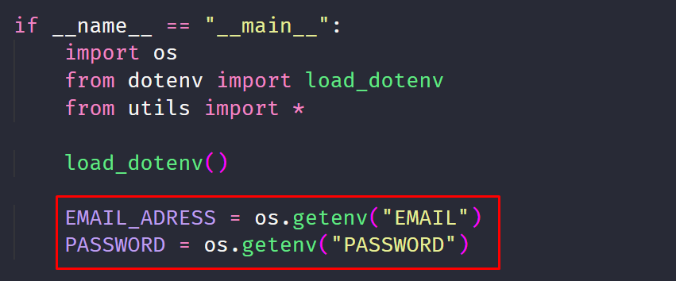

# Bem vindo ao **E-mail validator**!
<p></p>

Em qualquer site que você tentar criar uma conta hoje em dia e bem provavel se deparar com uma _validação de e-mail_, que geralmente utiliza um código gerado de forma aleatoria para concluir a validação. Neste repositorio eu refiz está validação com e-mail, em que este e-mail é realmente enviado, e utilizando de uma das bibliotecas de interface grafica do Python simulei um possivel caso real deixando pro usuario final simples e possivel de entender.
## Redes Sociais
* [Instagram](https://www.instagram.com/claudiogfez/)
* [Linkedin](https://www.linkedin.com/in/clcostaf/)

# Pré requisitos
```
python 3.6 or greater
```
_OBS: Checar a versão do PySimpleGui nos requirements.txt_
# Instalação

1. Primeiramente você pode clonar este repositório.

```
git clone https://github.com/clcosta/email-validator-python.git
```

2. Agora a instalação das bibliotecas

```
pip install -r requirements.txt
```

# Como utilizar

A forma de utilizar é bem simples, você tem que fazer uma unica configuração antes de rodar a aplicação e conseguir enviar e verificar seus e-mails.

**Você envirará pros usuarios do app um email com o código de verificação**, então é necessário colocar um e-mail que você é proprietário.

Junto desta informação, se estiver usando gmail você precisará fazer um configuração dentro da sua conta, que permita que o código em python envie os emails.

[Para ativar a configuração em contas do google é só clicar aqui](https://myaccount.google.com/lesssecureapps?pli=1&rapt=AEjHL4NzIPnnV8-w6mkMxx9pRbQ7DHGIy1svIBybAJKyi9030M6vY_A3GRe_R0W-MJfKaw2Y4PuAk4sFbfnQUgCckmtNnHv_dg)

---

### _"Onde colocar as informações de E-mail e Senha em que sou proprietário?"_
O codigo em python está preparado para receber um arquivo **.env** onde terá as informações de e-mail e senha, porém você pode colocar diretamente código se preferir, estás constantes estão no arquivo _app.py_.


 
 ---

### _"Quero mudar a mensagem do corpo do e-mail"_
Durante a construção do código, eu escolhi escrever o corpo do e-mail dentro uma constante chamada **MESSAGE**, ela se encontra no arquivo __utils/email_message.py__ e está escrita em _HTML5_, onde a personalização do conteúdo do email fica mais adaptável a vontade do autor.
 
 ---

**Agora que o E-mail e senha estão configurados, a mensagem está personalizada é só rodar o aplicativo com o código.**

```
python app.py
```

# Autor
| [<br><sub>@clcostaf</sub>](https://github.com/clcosta) |
| :---: |
